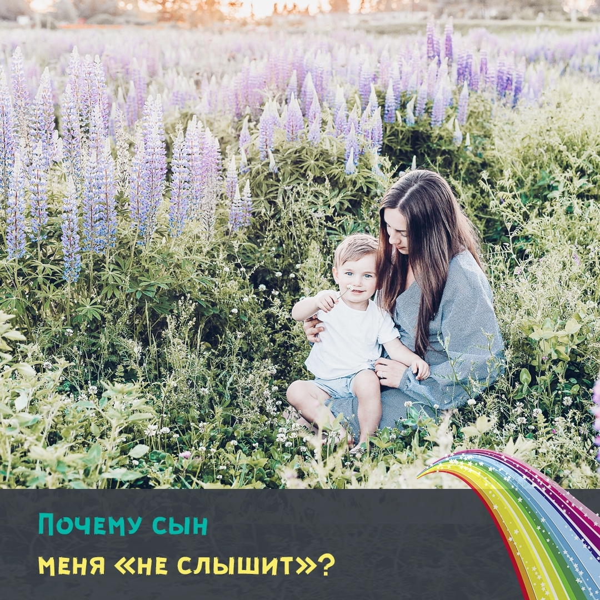

Мама задает сыну вопрос. Ноль реакции. Задет второй раз. Ответа нет.

В чем дело? Почему он как-будто не слышит?

Давайте разбираться 😉

Ответ прост.

У мужчин иначе происходит обработка информации, нежели чем у женщин. У нас она более эмоциональная, и интуитивная. Женщина может «думать» одновременно в нескольких направлениях – но не благодаря разуму, а благодаря чувствам. Поэтому, кажется, что женщина «быстрее соображает», или ей быстрей, чем мужчине становится «все понятно». Только за счет эмоционально-интуитивного способа обработки информации.

У мальчиков все иначе! Они обрабатывают информацию по законам логики. Одно вытекает из другого. В их обработке информации значительно меньше эмоциональных оценок и домыслов. Но и процесс выдачи готового результата у них более длителен, чем у девочки. Если мы что-то вкладываем в наших сыновей – нужно дать им время обработать информацию.

Иногда нас может поразить результат обработки информации – мальчик выдает такое изречение, которое нужно срочно записать. Женщине такое и придумать сложно! 😅

Или выдает ответ спустя некоторое время, когда вы уже и думать перестали об этом вопросе 😉

Нужно обязательно помнить о мужской логике и о последовательности обработки информации, когда просите о чем-то вашего сына.

И помните, что доводы, которые вы приводите сыновьям, должны были достаточно аргументированы ❗

Объясните зачем и почему, дайте время подумать, и вы увидите прекрасный результат 😉

На онлайн-курсе "Основы воспитания мальчиков" этот вопрос мы разбираем более детально. А также многие другие особенности, которые помогут вам понять ваших мальчишек и найти к ним подход.

Чтобы узнать еще больше об особенностях воспитания мальчиков и записаться на курс переходите по [ссылке](https://raduga-skazok.ru/2018/03/22/seminar-trening-dlja-roditelej-osnovy-vospitanija-malchikov/) 🌞

Работа будет в мини скайп-группах. Поэтому, помимо информации, будет возможность по максимуму проработать ваши запросы ☺️
