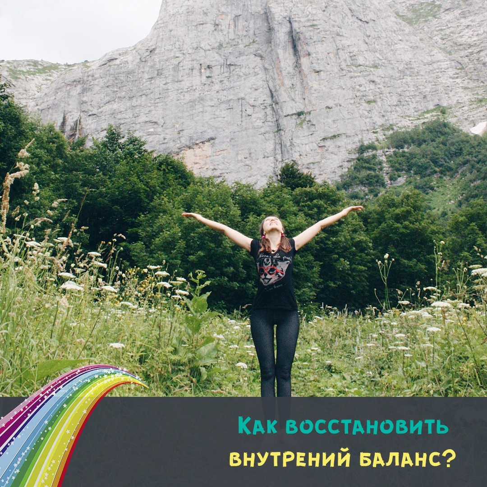

import { PostLink } from '../../components/postLink';

## Места вашей силы

Что за Места Силы такие? Где их искать? Спросите вы.

Друзья, предлагаю вам сказочную практику по поиску своих Мест силы.

Для этого нужно отправиться во Внутренние Путешествие. Все важные для вас Места Силы находятся внутри вас, в вашем сердце _(методика основана на сказке Нины Сумирэ)_.

Итак, устраивайтесь поудобнее и начинайте свое путешествие.

💫 Закройте глаза и представьте свое первое и главное место Силы — **Родину**.

Почувствуйте, как наполняетесь энергией Рода. Это поможет обрести корни, вернуть свою целостность, получить питание, расцвести

💫 Второе Место силы — это **Воспоминания**.

Представьте себя в самом любимом своем моменте прошлого, в том возрасте, когда вы чувствовали себя юными, полны энтузиазма, вдохновения, счастья—в своем детстве, в воспоминаниях. Пусть все добрые, влюбленные, смешные, волнительные воспоминания наполнят вас прежней силой, предлагая ее из своего неиссякаемого источника.

💫 Третье Место силы — это **места, где вы оставили свою Силу**.

Где не простили, и не завершила отношения, где не попросили прощения, где не сказали доброе «Прости, прощай, благодарю за все!», где не осознали своих уроки.

Чтобы забрать отсюда свою Силу достаточно понять, простить, сказать прощальные слова, попросить прощения, пожелать счастья, отпустить руку и получить обратно всю свою энергию у теперь уже бывших болезненных воспоминаний.

Представляйте, что ваша сила–прекрасная светящаяся нить. Идите мысленно по тем местам и ситуациям, где вы эту силу оставили,и представляйте как она тёплыми светом возвращается к вам.

💫 И последнее Местом Силы - это **воспоминания о тех временах, когда вы выдержали удары судьбы**.

Где вы не сдались, не предали мечту, где завершили начатое, где прошли через все трудности, встретившись с ними лицом к лицу, обретя мудрость Уроков. И стали еще сильнее.

Почувствуйте прилив вдохновения, ощутите поддержку, услышьте нежный голос сердца:«У тебя все будет хорошо, ты справилась со всеми испытаниями тогда, справишься и в следующий раз, сегодняшняя трудность превратится в твою новую Силу»

Запишите все, что вам открылось.И даже нарисуйте эти места силы. Это будет еще более ценно для вас.

С верой в вас, фея-сказочница Яна Тимощук.
