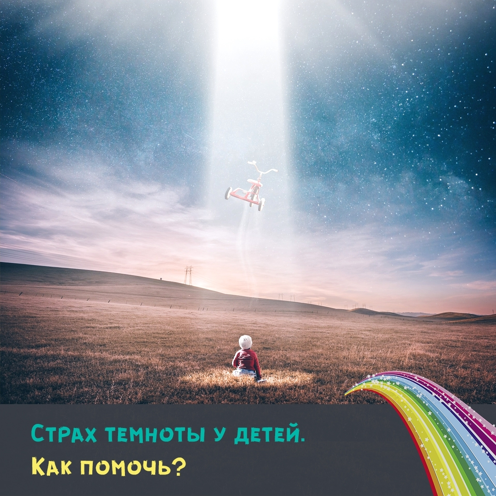

## Кто живёт в темноте?

Обычно именно об этом думают малыши, когда боятся засыпать без света.

Как же помочь сгладить боязнь темноты? 👀

Страхи - это нормально для детей. Но вы все же можете помочь малышу быть спокойнее 😊

**Что делаем?**

💫 Соблюдайте ритуал отхода ко сну.

Каждый вечер в одно и то же время делайте привычные действия: устройте вечер обниманий, купаний в ванной с мыльными пузырями, почитайте знакомую добрую сказку.

Чем устойчивее ритуал, тем спокойнее и увереннее будет чувствовать себя ребенок.

💫 Нельзя подтрунивать над страхами, а тем более стыдить их за это.

💫 Назначьте ребенка властелином света.

Не надо принуждать его спать в темноте. Трех-четырехлетний малыш уже может сам включать-выключать ночник. Пусть погасит свет, если захочет, или оставит его гореть. Позвольте ребенку быть хозяином положения.

💫 В течение дня не упускайте возможность поэкспериментировать с темнотой. Есть такие места в квартире, где достаточно темно, не торопитесь включать свет. Можно сполоснуть руки, сходить на горшок, отнести белье в стиральную машину без света в ванной.

💫 Играем во всевозможные игры на осязание в темноте. Надо узнать игрушки, ощупывая их в темноте. Начинать лучше с завязывания платочком глаз при свете, а лишь потом через пару недель переходить к настоящей темноте.

💫 Не стоит ничем и никем пугать ребенка, даже сказочными персонажами.

💫 Страх надо конкретизировать и вынести наружу.

Малыш ведь боится не самой темноты, а чего-то, что прячется во мраке. Чего? Вот это и надо выяснить.

Ненавязчиво выспросить, попросить нарисовать это чудовище (Бабу-ягу, огромную собаку, волка или привидение…), вылепить из пластилина. Потом можно сочинить историю вместе с ребенком, как герой побеждает этот страх и уничтожить его (раздавить, порвать, сжечь).

Лучше это делать днем, а к вечеру сказать, что монстр тебя не побеспокоит, ведь ты его победил 💪

💫 И конечно, без терапевтических сказок не обойтись. Читайте сказки о героях, которые тоже боялись темноты и потом справились 🌞
