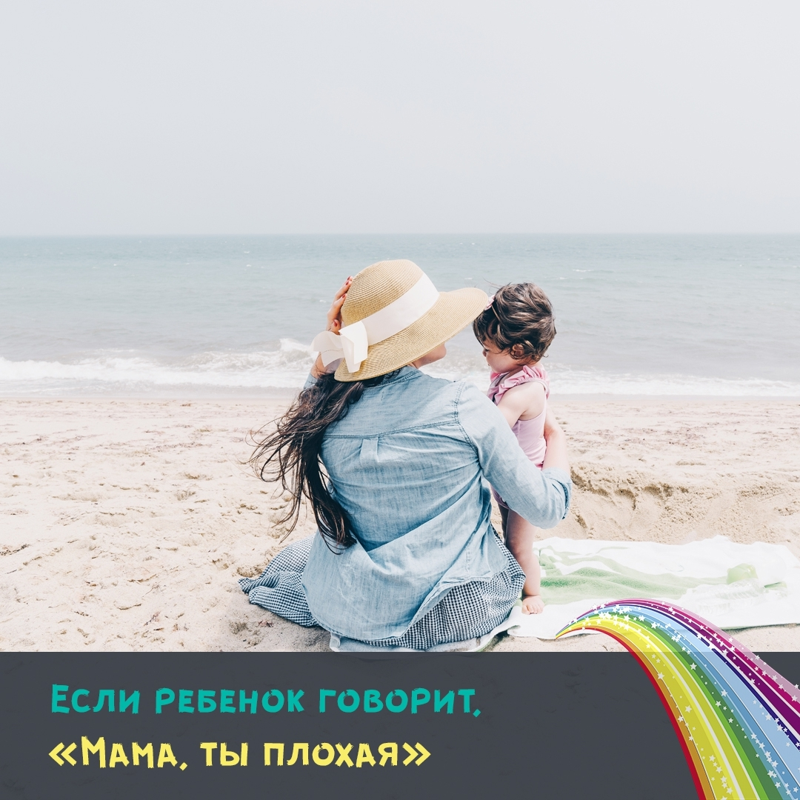

## — Мама, я тебя не люблю

Поднимите руку, кто из вас сталкивался с таким неожиданным высказыванием от ребенка? 🙋

Когда вы слышите от своего малыша фразы, по типу "Ты плохая", "Я тебя не люблю", "Уйди от меня", не спешите обижаться на ребенка.

**Что обычно делают родители в ответ?**

Обижаются тоже, начинают ребенка ругать и объяснять, что так говорить не хорошо или наказывают.... А еще, могут в ответ сказать, "Ну тогда и я тебя не люблю", "Уйду от тебя".

Но все это не помогает делу 🙅

Давайте разбираться, что пытается сказать ваш ребенок, когда говорит такие неприятные для любой мамы слова 👇⠀

На самом деле, все эти слова и фразы, на детском языке означают, что ребенок рассердился или обиделся. Он говорит таким образом, "Мама, я на тебя сержусь".

Дело в том, что ребенку еще сложно сказать это по другому. Он просто не знает как это сделать, потому что он только учится распознавать свои эмоции и чувства. Он говорит так, как может, и как умеет это выражать.

**Что можете сделать вы, родители?**

Помогите ребенку осознать, что он испытывает. Скажите ему:

- Ты наверное на меня рассердился, поэтому говоришь так?
- Ты наверное обиделся, что такие слова говоришь своей маме?

И дальше, расскажите, как можно выражать свои чувства:

- Если ты обиделся, скажи, "Мама я обиделся на тебя".
- Если если сердишься, то можешь сказать, "Мама, я на тебя злюсь"

Через некоторое время ребенок научится выражать свои чувства как мы, взрослые. Ну, а пока, ему необходима ваша помощь 😊

Помните, все дети любят своих родителей, так же как и родители своих малышей 🌞

Всем добра! Ваша фея-сказочница, Яна Тимощук ✨⠀
