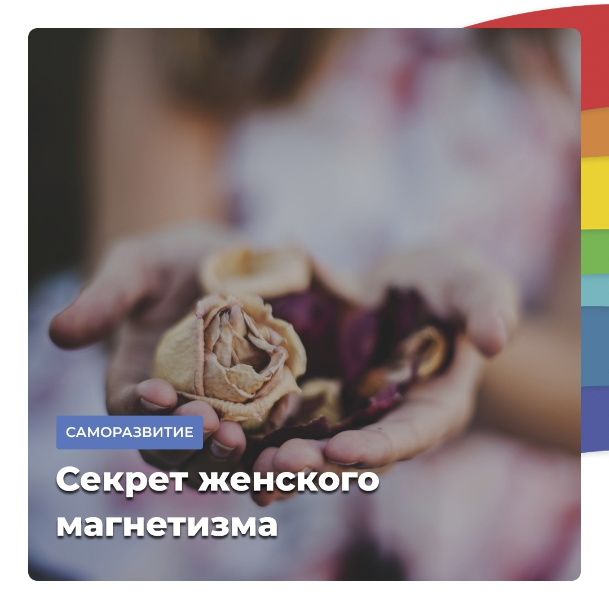

## Тест на уровень женского магнетизма

Хочется сразу сказать, под женским магнетизмом нужно понимать именно результат внутреннего труда женщины, а не набор некоторых ее способностей. Любой внутренний труд, любые добрые усилия, направленные на раскрытие и совершенствование собственной женской природы, приведут к усилению женского магнетизма.

**Основа женского магнетизма** — чистый и управляемый Женский зов, примирение с самой собой, самоуважение и любовь к себе.

Женский магнетизм получает питание от пространства, в котором живет женщина. Ему нужна свобода обмена с окружающей средой. Пыль, вышедшие из строя вещи (которые жаль выбросить), хлам – все это создает препятствия для такого обмена.

В этом отношении особенно важны в жилом пространстве женщины окна. То, что чувствует женщина в отношении состояния своих окон, можно провести экспресс-тест на уровень женского магнетизма.

Просто спросите себя:

- Что я чувствую по отношению к окнам в своей квартире?
- Какие они для меня?
- Чего бы мне хотелось по отношению к ним?

И вы довольно точно опишите текущее состояние собственного женского магнетизма, и даже сформулируете необходимые меры для его повышения 😉

**Что же еще важно делать женщине для поддержания женского магнетизма?**

💃🏻 Танцуйте! Танцы спонтанные, классические, эротические и, главное – спонтанные! Танцуйте дома под музыку, которая вам нравится, просто закройте глаза и танцуйте!

🎤 Пойте! Пойте дома всегда! Пойте, что хотите! Не знаете слов – напевайте. Просто заведите себе такую привычку

🍎 Старайтесь питаться правильно. И, главное, - готовить не для того, чтобы набить желудок, а готовить с пониманием, что вы обмениваетесь с Миром энергией ©
