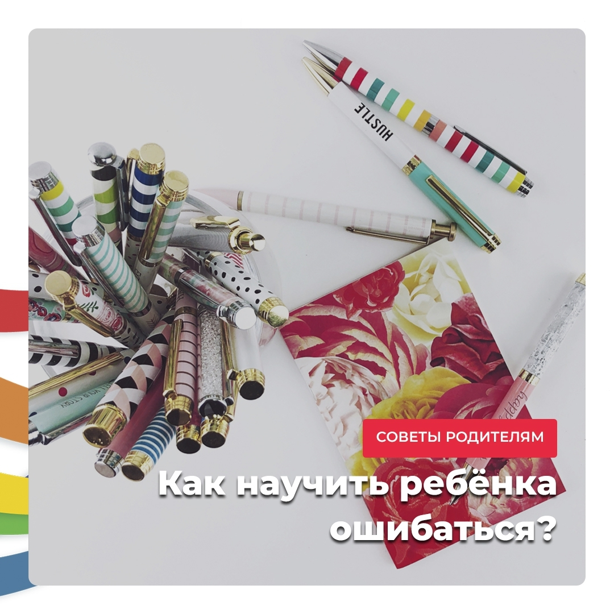

import { PostLink } from '../../components/postLink';

## Метод «зелёной ручки»

Это отличный метод научить ребенка не зацикливаться на ошибках.

Вот представьте: ребенок старается и пишет в своей тетради буковки. Его тетрадь проверили и нашли 10 ошибок. Поставили двойку.

На следующий раз он снова старается, и уже делает 8 ошибок. Но все-равно получает два... 😐

**Как вы думаете, будет ли у ребенка мотивация к обучению?** 🙍

Автор собственного блога и мама Т. Иванко поделилась своим опытом касательно пометок в тетради своего ребенка. Она не использовала красную пасту вообще. Наоборот, она брала зеленую ручку и выделяла то, что у дочки получалось хорошо.

Если в случае с красной ручкой мы акцентируем внимание на ошибках, то тут, наоборот, _концентрация внимания на успехе_.

Подсознательно мы с вами запоминаем то, что выделено, а значит, либо ошибки и корявые буквы, либо красивые удачные линии. Все зависит от подхода. Если выделять то, что получилось хорошо, ребенок мотивируется не избегать ошибок, а делать качественно и правильно! Ребенок перестает концентрироваться и зацикливаться на ошибках, он не боится их, как большинство современных деток.

В результате такие дети, и потом взрослые, более удовлетворены жизнью и умеют замечать хорошее!

Дорогие родители, очень хочется, чтобы вы намного чаще замечали то, что у ваших деток получается и говорили им об этом. Вместо того, чтобы каждый раз делать акцент на том, что не правильно.

Именно ВЫ самый первый учитель для своего ребенка. Помните, что ваша задача – не наказать, а показать, к каким последствиям приводят неправильные действия, и с участием ребенка эти последствия устранить.

Говорите со своими детьми. Не просто запрещайте, а обоснуйте свой запрет. Давайте им ваше внимание, будьте им друзьями, спрашивайте их мнение и тогда у них не будет повода "плохо" себя вести 😉

А если есть вопросы касательно процесса воспитания, <PostLink to="#how-to-get-consiltation">записывайтесь ко мне на консультацию</PostLink>.

Обязательно найдем решение 😊

Искренне ваша, фея-сказочница Яна Кулишова ✨
