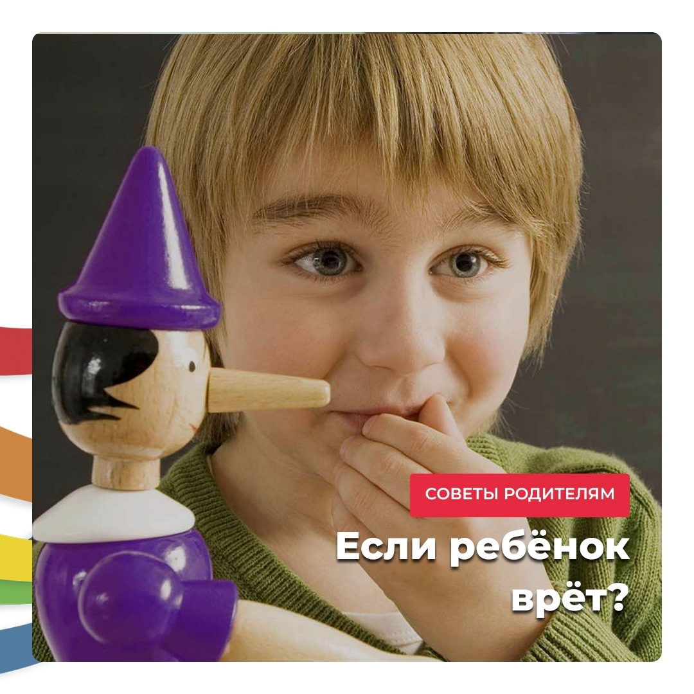

_Если вы заметили, что ребенок начинает врать, можно воспользоваться такой подсказкой от Т. Д. Зинкевич-Евстигнеевой._

Крайне важно подготовиться к разговору с ним о «**внутреннем лгуне**».

Это такой персонаж нашего внутреннего мира, который склонен все переворачивать с ног на голову, подменять правду ложью. Нужно будет объяснить ребенку, что такое ложь.

Для этого в сказках есть две метафоры: **Правда** и **Кривда**. Можно начать разговор с ребенком так:

— Жили на свете Правда и Кривда. Правда просто жила и делала свое правое дело. А Кривда все время ей завидовала, и старалась разрушать то, что сделала правда. Так и появилась Ложь. Как дочка Кривды.

Она очень любила наряды менять. Чтобы люди ее любили, ею восхищались и с ней дружили. А было Кривде известно, что кто с ее дочкой дружбу заведет, тот и ей, Кривде, дверь в дом откроет. А про Правду, что в каждом доме всегда почетной гостьей бывала, и вовсе позабудет.

Что тогда у людей начнется! Все вкривь и вкось! Люди запутаются окончательно, что правда, а что ложь отличать перестанут.

_Как ты думаешь, чем это людям грозит?_

— Да, большими бедами это людям грозит. Главное им понять, с чего все началось? С кем они дружбу завели? Как так случилось, что они Ложь в дом пустили?

А понять это нелегко. Ложь уходить не желает, глаза и разум застилает. Еще бы! Живет припеваючи, на всем готовом, в почете и уважении, кто ж от такого откажется по своей воле?

Как ты думаешь, есть ли способ выгнать Ложь из дома? Кто это сможет сделать и как?

Давай думать вместе, спасать героев этой истории. Может и нам с тобой это в жизни пригодится!

~

Разговаривайте с ребенком, слушайте, что он вам ответит.

Не бойтесь фантазировать, рисовать и писать истории на эту тему.

Детское мышление - магическое, и они с радостью придумают волшебные слова и ритуалы для победы над Кривдой 😉
