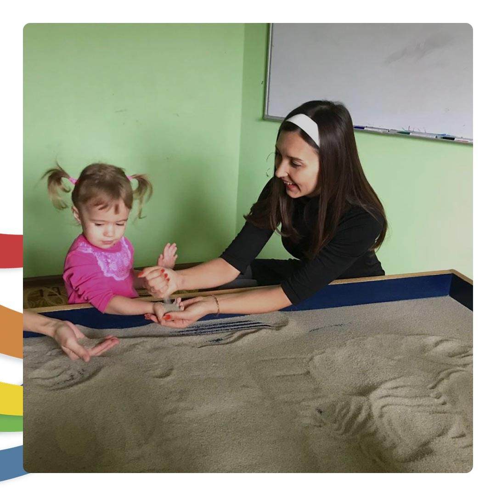

import { PostLink } from '../../components/postLink';

## — Ты меня вообще слушаешь?

Думаю вы множество раз задавали такой вопрос своим детям, когда не видели ответной реакции на свою просьбу.

И это вполне естественно, потому что навыку слушания нужно учиться.

Предлагаю несколько шагов, которые помогут ребенку слушать 👂

🔹 Опуститесь на уровень ребёнка, когда разговариваете с ним. Не кричите с другого конца комнаты (в таком случае он и правда может не слышать, ведь увлечен своим делом).

🔹 Установите контакт глаз и тактильный контакт (ласково дотронуться до руки, спинки, например)

🔹 Говорите «чётко и по делу» 😄 Когда много слов, дети не воспринимают информацию.

🔹 Попросите ребёнка повторить то, что он услышал. Если нужно, мягко уточните, понял ли он вашу просьбу.

🔹 Если важно договориться, то придите к варианту, который будет обоюдно выгодным для обоих.

Когда ваш собеседник чувствует, что вы слышите и понимаете, он склонен сотрудничать с вами. Поэтому, чтобы чувствовать больше уверенности в себе и меньше напряжения, нужно немного вашего труда и терпения 😊

Добра вам ✨

И помните, если есть трудности в процессе воспитания, <PostLink to="#how-to-get-consultation">приходите на диагностику</PostLink>. Вместе найдем ответы 🤗
