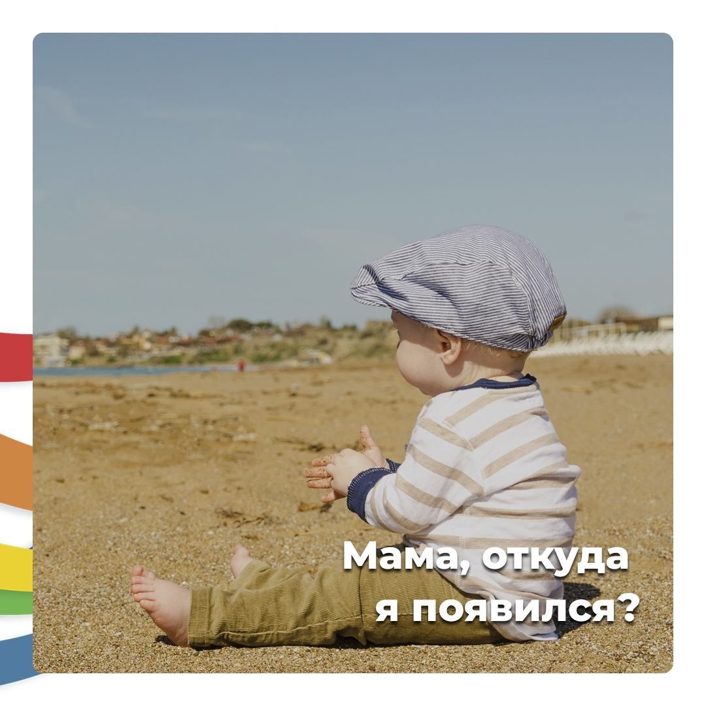

## Неловкий вопрос

Что делать, если ребенок спросил напрямую: «Откуда берутся дети?»

Разбираемся с этой темой.

Во-первых, можно ребенку спокойно сказать: «От Любви папы и мамы!». Дальше подождать, что дальше спросит ребенок.

В разговоре о появлении детей важен _принцип порционности информации_.

> Спросил — получил короткий красивый ответ — пауза — новый вопрос.

Например:

**— Мама, а откуда я взялся?**

— Что ты имеешь в виду?

**— Как я родился?**

— КАК ты родился или ОТКУДА ты родился?

**— … откуда.**

— Из моего животика. Сначала 9 месяцев ты жил внутри меня. Мой живот был твоим домом. Потом ты вырос настолько, что уже смог самостоятельно жить в мире людей и природы, и вышел на свет. Тебе помогали в этом добрые люди, врачи.

**— А как я родился?**

— Головой вперед! Ты с самого начала был очень славным и умным!

Вроде вопрос исчерпан. Пусть ребенок думает дальше.

Если будет следующий вопрос, по типу, как я попал в живот, можно вот что сказать:

— Для того, чтобы появился ребенок у мужчин и женщин есть специальные клеточки, которые должны соединиться у мамы в животике. Папа и мама соединяют свои половые органы, и папина клеточка переходит к маме. И потом из них начинает расти малыш.

Для ребенка 5-6 лет этих ответов достаточно.

> Главное — **дозированность информации**.

Если ребенок не спрашивает, не стоит сразу все ему говорить. Потому что для него это будет лишним и непонятным.

Всегда рада помочь вам в вопросах воспитания на личных консультациях. Записывайтесь 😊

P.S. Рекомендую вам книгу «Простые истины или беседы с кирским мудрецом» (Т.Д. Зинкевич-Евстигнеева).

В самом конце этой книги есть раздел о сказкотерапия интимности. Вы найдёте там примеры диалогов с дочерью и сыном об этой теме. Очень деликатно все описано.

Ваша фея-сказочница, Яна Тимощук ✨
