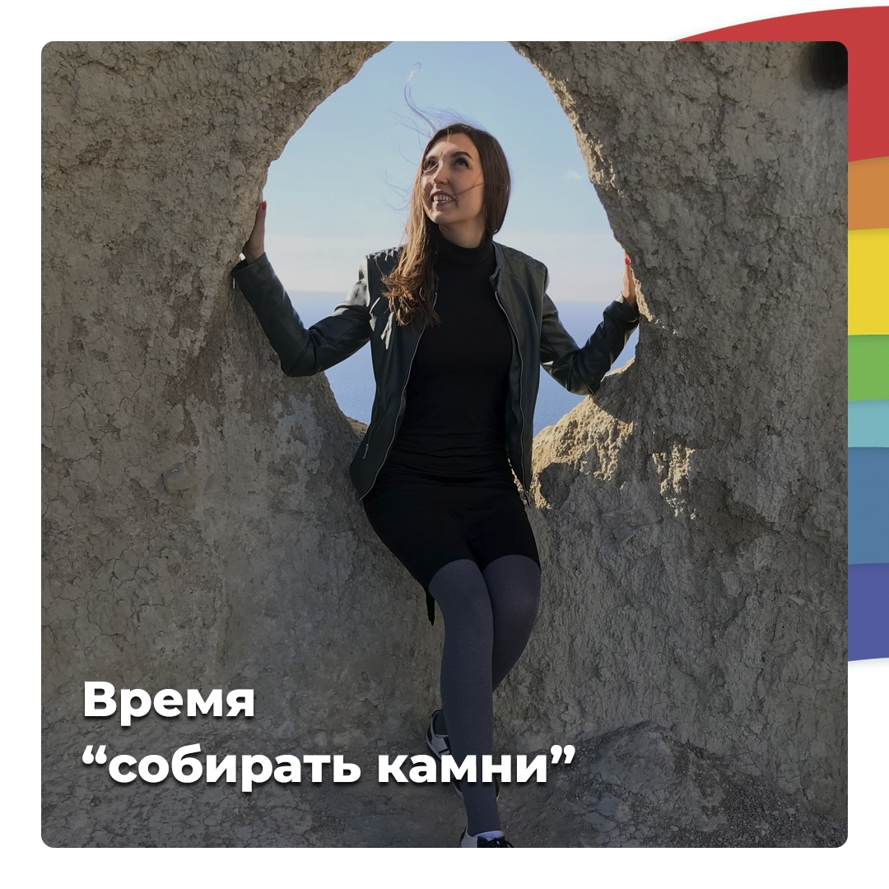

import { PostLink } from '../../components/postLink';

## Принятие своей самоценности

Ни для кого не секрет, что мир развивается и мы тоже не стоим на месте. У каждого из нас своя судьба, свой путь, который готовит свои уроки, свои радости и трудности. И каждый новый день мы открываем для себя новые грани 😊

Каждое завершение цикла приносит новое состояние сознания. И оно всегда проходит проверку старыми отношениями, старыми привычками, ожиданиями близких людей. Сможет ли человек, вернувшись в прежнюю среду, принимать решения в соответствии с новым уровнем своего сознания? Или он станет вести себя как раньше, совершать старые ошибки?

Перед началом нового жизненного этапа важно достойно завершить то, что нуждается в завершении, или получить заслуженную награду. Поэтому очень важно собирать урожай своих достижений и побед!

И я могу повторять это хоть каждый день, потому что это важно и действительно помогает чувствовать себя более гармоничными.

Сегодня от меня несколько вопросов-заданий. Они, как всегда, сказочные и необычные, но очень эффективные 😉

Итак, **каким был ваш предыдущий период?**

🔹 Перечислите то, что является предметом вашей гордости. Расскажите, какие усилия вы приложили, чтобы достичь этого.

🔹 Нарисуйте символы ваших достижений. Это ваш символический урожай жизненного опыта.

🔹 Найдите слова сердечной благодарности тем, кто помогал вам в жизни, тем, кто учил вас. тем, кто не давал вам покоя и заставлял искать новые решения.

Уверена, что вы будете удивлены, осознав, сколько всего вы уже смогли достичь.

А если возникли трудности, всегда рада ответить на ваши вопросы на <PostLink to="#how-to-get-consultation">бесплатной диагностической консультации</PostLink>.

Искренне ваша, фея-сказочница Яна Тимощук ✨
