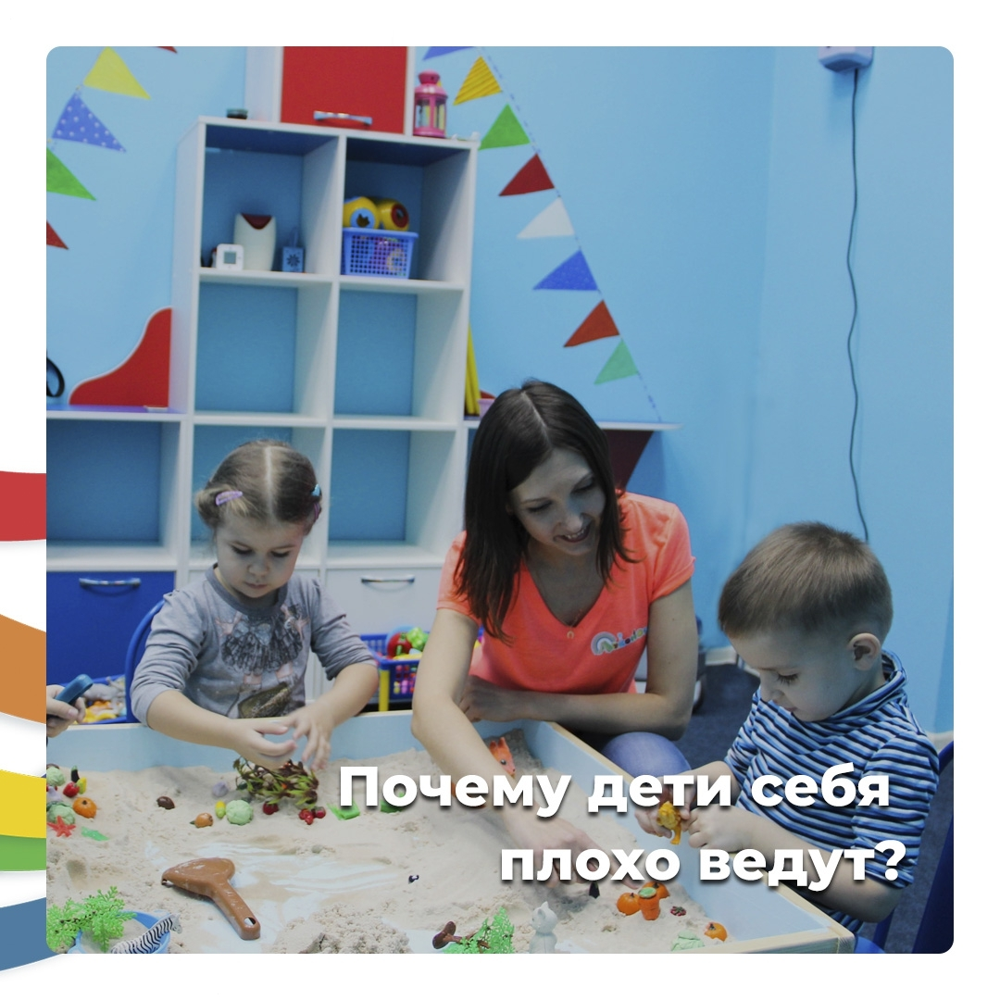

Практически каждый родитель задается вопросами: «Почему он не слышит, что я ему говорю», «Почему с ним невозможно договориться?», и т.п.

Чтобы понять, в первую очередь ответьте на вопрос: что ребенок хочет вам этим сказать, чего добиться? Потому что причина есть всегда.

> И одна из таких - это нехватка внимания со стороны взрослых.

Если ребенок не дополучат качественного внимания, то будьте готовы, что он его будет привлекать через МИНУС. Т.е. будет себя плохо вести. Он начнет перебивать, лезть на стол с ногами, капризничать или брать то, что не разрешают.

Ведь именно в этом случае вы не сможете не обращать внимания. У кого терпения побольше, договоритесь. У кого меньше - накричите или шлёпните...

> Ребенку неважно **как** вы дали это внимание.

Важно, что **_заметили_**. И если такой способ работает, он закрепляется в его поведении.

Чтобы вы и ребенок были спокойны помните об этой потребности. И давайте качественное внимание своим детям:

🔸 чаще обнимайте его, гладьте по голове, кладите руку на плечо;

🔸 замечайте его старания и успехи и проговаривайте в слух (даже самые незначительные);

🔸 говорите ласковые слова (солнышко, мой хороший, люблю тебя, я по тебе скучала, как хорошо у тебя получается);

🔸 и еще, договоритесь про ваше с ним "волшебное время". Ниже можете почитать отзыв на такой способ от одной из моих мам после <a href="https://raduga-skazok.ru/2018/03/22/seminar-trening-dlja-roditelej-osnovy-vospitanija-devochek/" target="_blank">курса по воспитанию девочек</a>.

> Каждый день (это важно) проводите с ребенком **около 30 минут**.

В это время откладывайте все гаджеты и просите близких не беспокоить вас. И занимаетесь с ребенком тем, что захочет и предложит он. Именно он, а не вы.

Таким образом малыш будет чувствовать вашу любовь и то, что вы не только воспитатель, но еще и друг 😉
