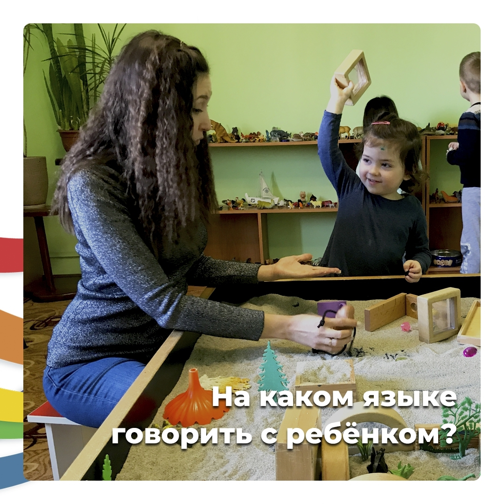

Вот представьте, что вы разговариваете с человеком, который не знает русского языка. Ведь вы же не будете в этом случае злиться и сердиться, что он вас не понимает? 😉

Но почему же мы так сердимся, когда не получается найти общий язык с ребенком? Дети просто не понимают наш взрослый язык.

Дорогие родители, малыши дошкольного возраста не понимают наш взрослый язык логики. Они понимают и отлично говорят на языке игры 😊

Поэтому чтобы не расстраиваться, не стоит разговаривать с детьми фактами и нравоучениями. Даже если и кажется, что вы говорите совершенно понятные вещи.

> 💕 Попробуйте сказать «пойдем ловить микробов», вместо строгого «идем чистить зубы».

Вы увидите, что ребенок откликнется намного лучше на фразу про микробов.

Или же, вместо «**иди убери в комнате, здесь невозможно уже пройти**», скажите «**давай уложим игрушки спать на свои кроватки-полочки (коробочки), а машинки поедут отдыхать в гараж**».

Если ребенок не хочет уходить с площадки, попробуйте придумать ролевую игру и сказать: давай мы сейчас как будто зайчики попрыгаем домой, или превратимся в какого-то героя. В такой форме намного легче договоритья с ребенком что-то сделать.

Поверьте, это совершенно не глупый способ. Помните, что в каждом из нас есть Внутренний ребенок, который обязательно вам подскажет как договориться со своим малышом. Просто подумайте, а что бы вам маленькой было интересно в той или иной ситуации услышать 😉

И если кажется, что так ребенок никогда не научится воспринимать серьезно такие слова, то уверяю вас - научится. Просто всему свое время. Ближе к подростковому возрасту им действительно важны факты и серезные логические пояснения. А пока ребенок маленький побудьте с ним «на одной волне» 😘
