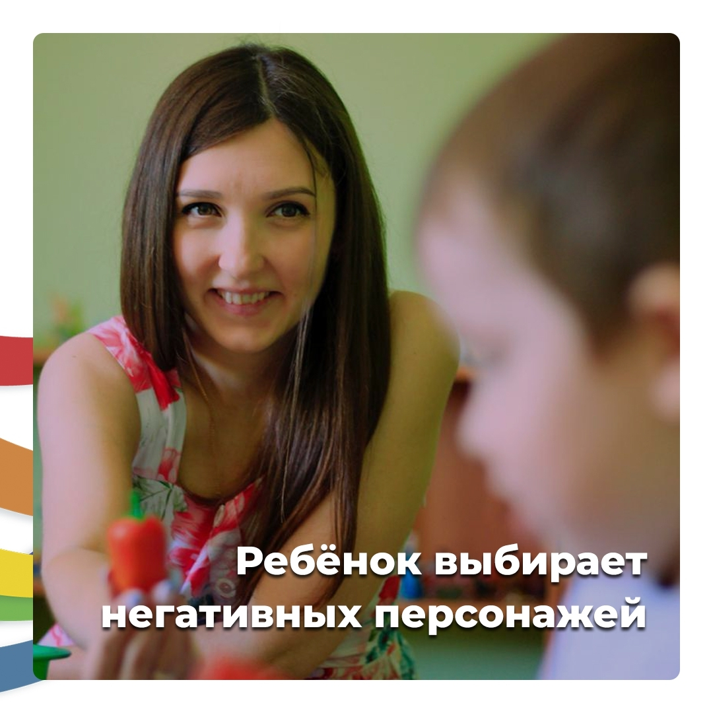

Часто ребенку нравятся отрицательные персонажи в мультфильмах и сказках. И он даже хочет им подражать…

## Стоит ли переживать? 🤔

Главное, не пугаться. Если ребенок еще маленький и вы видите, что ему нравятся герои, которые вызывают у вас осуждение, не думайте, что ребенок делает неправильный выбор. Для начала нужно постараться распознать, почему ребенку нравится именно эти персонажи.

Может быть, он обладает такими качествами, которых ребенку не достает. Возможно, именно отрицательный герой всех побеждает, может быть, отрицательный герой умеет преодолевать свои слабости. Другое дело, какими способами он это делает…

Но ведь средства можно не переносить в свою жизнь, а вот качества, такие как целеустремленность, например, можно. Словом мы должны отфильтровать информацию об этом герое. А сделать это можно только через беседу:

— Ну что же, раз тебе нравится это герой, тогда расскажи, почему? Что такого есть в этом персонаже, что тебя так привлекает?

Ребенок откликнется, и расскажет вам. А вам главное внимательно слушать. А потом делать выводы.

— Значит, ты говоришь, что этот герой самый изобретательный. И с ним никогда не скучно. И оказывается для тебя этот герой самый настоящий победитель, и ты учишься у него побеждать.

> Мы отделяем качества героя от его поступков

Важно вернуть добрые качества ребенку, отделив их от не очень хороших поступков.

Например:

— Значит, тебе нравится этот герой, потому что он выдумщик и фантазер.

Значит ты можешь научится у него фантазировать, и находить выход даже из самых сложных ситуаций. Но не бери всю манеру поступков от этого героя. Потому что не всегда он бывает честен.

И этот персонаж тебя предупреждает, что можно быть бессчетным и злым, но иметь какие-то и хорошие качества.

Так вот, ты этим качествам учись, а злобу отгоняй. И тогда твой характер будет крепким и здоровым. И я в тебя верю!

Не спешите пугаться того, что ребенок выбирает в качестве образца негативного персонажа.

Разберитесь, пожалуйста, что происходит и что привлекает ребенка. И отделите хорошие качества от нравственных болезней. И опыт этого отделения передайте ребенку.

Тогда характер его будет здоровым 😊
