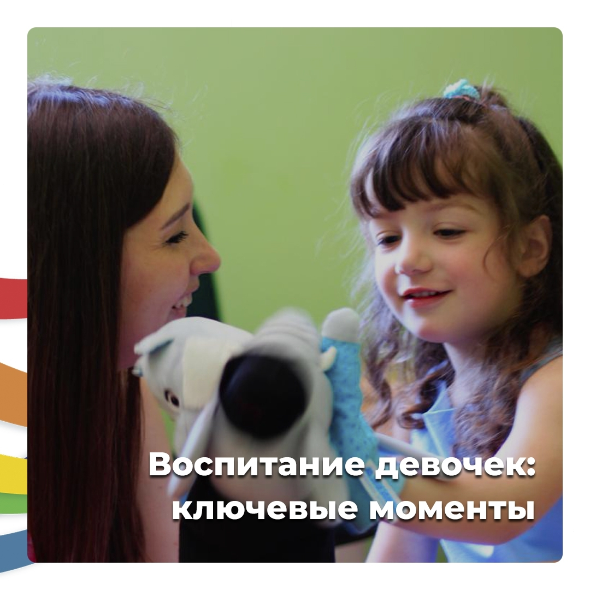

Неделю назад я закончила работу с группой прекрасных мам по курсу «Секреты воспитания девочек». Это были 5 невероятных встреч, на которых каждая из мам открывала для себя что-то новое. В первую очередь в себе.

Я очень благодарна каждой из них за обратную связь и за работу. И поэтому мне в радость было вручить им Дипломы мудрых мам 😊

Хочу немного поделиться основными мыслями из всего курса. И пригласить желающих мам поработать онлайн в этом направлении. <a href="https://raduga-skazok.ru/2018/03/22/seminar-trening-dlja-roditelej-osnovy-vospitanija-devochek/" target="_blank">По ссылке</a> вы можете ознакомиться с развернутой программой курса.

## Ключевые моменты воспитания девочек

🔹 Девочки запоминают не столько то, _что_ мы им говорим, сколько то, **как** мы это говорим.

🔹 Девочка запоминает **образ действий матери**.

Ее слова, интонацию, отношения к жизни, людям. Словом не текст, а _подтекст_.

К примеру, вы считаете образ жизни вашего соседа Василия Петровича не совсем правильным (мягко говоря 🙈). Но никогда не озвучивали это при дочери.

Велика вероятность того, что дочь считает ваши чувства и отношение, а не то, что вы ей говорите (или не говорите).

🔹 Главное в воспитании девочки не сами идеи воспитания, а **способ их передачи**.

Например, вы тысячу раз повторили дочери, чтобы та прибрала свою комнату, а потом, не дождавшись от дочки правильных действий, накричали на нее, а то и дали подзатыльник…

Вы хотите передать идею, что _надо содержать свое личное пространство в чистите_, но способ передачи выбрали неверный.

В этом случае девочка усвоит, что _если близкого человека долго пилить_, долбить, ругать, а напоследок еще и треснуть хорошенько — чего-нибудь от него добьёшься из того, что тебе надо.

И эту идею она станет использовать в своей взрослой женской жизни.

🔹 **Все**, чему мы хотим научить свою дочь, **должно быть в нас самих**.

Или хотя бы мы должны пребывать в процессе работы над собой, чтобы то, что мы хотим передать дочери постепенно нарабатывалось внутри нас.

> Дочь смотрит на вас и учится, в первую очередь, **у вас**.

🔹 Прежде чем что-то целенаправленно воспитывать в своей дочери, надо проверить, в какой степени мы сами обладаем этим качеством.

Если вам кажется, что дочери не хватает терпения, проверьте, а у вас оно есть? 😉
