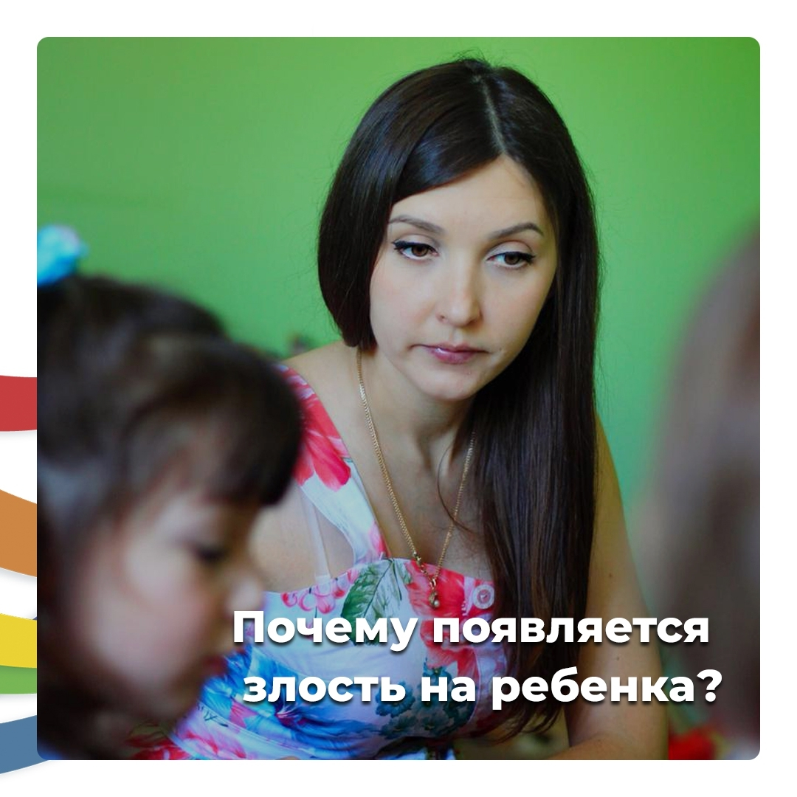

## Не хочу кричать, но иначе не получается

Если вы все время срываетесь на ребёнка, и понимаете, что уже не можете спокойно говорить, а только кричите, то самое важное понять причину вашего раздражения.

Давайте разберем несколько таких.

🔷 **Мама что-то просит сделать ребёнка, но заранее знает, что он не выполнит её просьбу** 😐

Например, мама говорит «мы уходим домой из парка», а ребёнок не прекращает играть и либо не слышит ее, либо кричит. И в мыслях сразу, «ага, я так и знала, что так будет, сейчас начнётся крик и скандал.»

Если вы замечаете такую цикличность у вас, то прежде чем задать вопрос, подумайте, что вы ожидаете от ребёнка? Что он вас услышит или у вас заранее сформировалась картинка, что у него будет негативная реакция?

## 🤔 Что можно сделать?

В течении дня замечайте моменты, когда ребёнок выполнил ваши просьбы. Их много, даже маленьких. Например, передал вам хлеб за столом, что-то принёс. Обратите внимание на ваше состояние в момент, когда он выполнил вашу просьбу.

На сколько вы были спокойны и уверены, что он услышит?

Зафиксируйте это состояние и пробуйте его переносить на те ситуации, где возникает негативный сценарий. И ещё, когда просите что-то, то заранее крутите в голове картинку, что ребёнок вас услышал и выполнил ваш запрос. Прямо как кино голове 😉

🔷 **Многие мамы не могут сказать «нет» своему ребёнку из спокойного состояния, им обязательно нужно разозлиться.**

Например, не просто говорят «выключи компьютер», а начинают читать целую лекцию «вот сколько можно за ним сидеть, уже невыносимо, и т.п.»

И только из этого гневного состояния мама готова что-то запретить и сказать нет.

Интересно то, что такое поведение, скорее всего проявляется не только в отношении ребёнка, но и в общении с другими взрослыми людьми.

Когда не можете сказать «нет» и чувствуете вину. А когда просят что-то, проявляются фразы по типу, «а почему я это должна делать» (как бы возмущение). И опять, чтобы отказать человеку, нужно выйти на агрессию.

Потому что есть внутренне убеждения, что если я отказываю, значит я плохая.

> Помните: отказывая ребёнку, **вы не становитесь плохой**

Вызывая агрессию, вы вредите ему больше. Поэтому проследите у себя эти состояния.

А дальше, говорите из сильной позиции и с сочувствием: я понимаю, что тебе не хочется уходить, я сочувствую, но сейчас будет вот так. Не доводите себя до злости.

Ну и конечно же, помните, что отказывать — это нормально 😉

🔷 **Cамое важное: высыпаетесь ли вы? Нет ли эмоционального выгорания?**

Потому что если есть, то ничего не изменится, пока вы не наладите своё ресурсное состояние.

Очень важно отдыхать и находить время для себя!

И знаю, что сейчас многие скажут, нет такой возможности. Но поверьте, есть. Нужно просто поискать.
