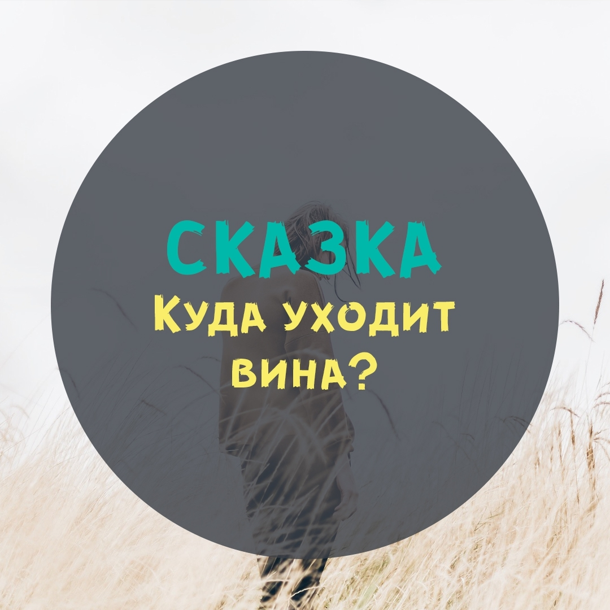

Шла по жизни Женщина, и было у нее два спутника: Вина и Палач. Когда-то, еще в детстве, Женщина познакомилась с Виной, но та представилась ей Совестью. Девочка поверила и взяла ее в спутницы, с тех пор так и бродили, рука об руку.

Вина по любому поводу выносила свои суждения и давала оценки (как правило, нелицеприятные). Если ее послушать, так женщина почти во всем была «сама виновата».

А Палач только и ждал, пока Вина подаст сигнал. Как только женщина начинала себя за что-нибудь казнить – Палач тут как тут, вместе со всеми своими зловещими инструментами. Только ему и трудиться особенно не приходилось: Женщина сама себя наказывала по поводу и без повода.

Она терзалась сомнениями – палач услужливо подсовывал ей крючья разного размера. Женщина занималась самобичеванием – Палач выдавал ей ремни и плетки. А еще в его арсенале были мигрень и аллергия, ломота в суставах и язва желудка, и еще много чего.

Разумеется, от такой жизни женщина болела, страдала, теряла красоту и совсем уж не могла радоваться жизни.

И вот однажды взмолилась она:

— Господи, почему я так трудно живу? Я еще молода, а чувствую себя дряхлой старухой. Моя душа истерзана, мне жить не хочется! За что мне такая судьба? Что я такого натворила, что ты отвернулся от меня?

И откликнулся Творец:

— Милая, это не я отвернулся от тебя, а ты от меня! Совести у тебя нет, вот что!

— Как – нет? – ахнула Женщина. – Вот же она, Совесть, всегда со мной! Учит меня, подсказывает…

— Ну уж нет! – категорически возразил Творец. – Это не Совесть, а Вина. И не учит, а мучит! Совесть – это когда ты помогаешь попавшему в беду. А Вина – это когда ты ввергаешь в беду саму себя. Ошибочка вышла!

— Да, я постоянно совершаю ошибки… — в смятении пролепетала Женщина.

— А давай не будем считать это ошибками? – предложил Творец. – Ты постоянно получаешь опыт, только и всего. И если тебе кажется, что результат нежелательный, просто учти и в следующий раз сделай по-другому.

— То есть я ни в чем не виновата? – уточнила Женщина.

— Если ты в чем-то и виновата, так в том, что присвоила себе право себя казнить, — ответил Творец. – Это ошибка, и ее действительно нужно исправить. Думаешь, я не ошибаюсь? Еще как! Но я всегда говорю: «Надо же, как интересненько получилось!». И тебе советую.

— А что мне сейчас-то делать?

— Наверное, отпустить Вину. А Палач удалится вместе с ней, они ведь парочка, он без Вины жить не может. Пробуй, экспериментируй! Это же твоя жизнь – побудь сама Творцом.

Женщина подумала-подумала и решила отправить Вину куда подальше. Получилось где-то возле экватора. Вина огляделась – тепло, зелено и море рядом. Купила себе купальник и шляпу и легла в шезлонг – загорать. А Палач переквалифицировался и показывает отдыхающим пляжникам фокусы. Оба довольны и на прежнюю работу возвращаться не хотят.

А Женщина, которая осталась без Вины и без Палача, поправилась, расцвела и творит, что хочет. А если что-то не так выходит, только и говорит:

«НАДО ЖЕ, КАК ИНТЕРЕСНЕНЬКО ПОЛУЧИЛОСЬ!».

_Автор: Эльфика_

Дорогие мои, отпускайте вину. Скажите: «Я себя прощаю!» и вперед на встречу Добрым возможностям ✨
