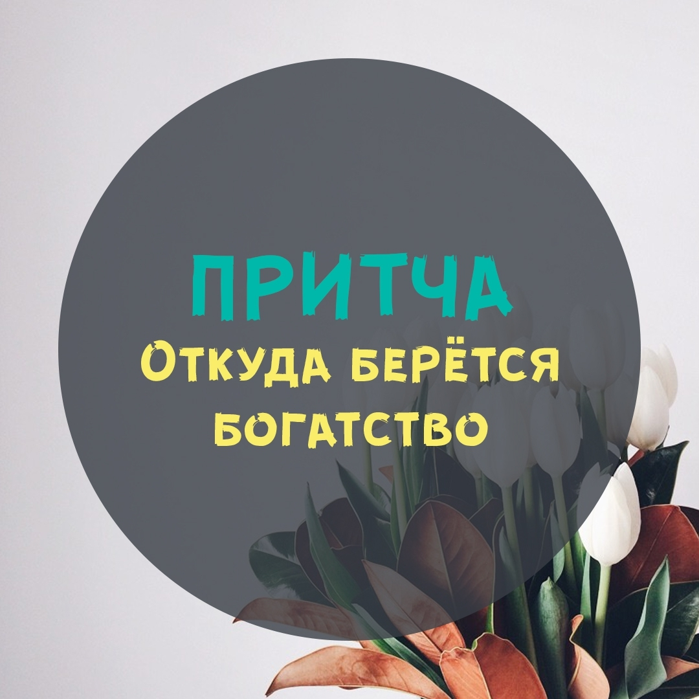

Когда Творец создал Вселенную, он просчитал все: количество атомов и молекул, проектную мощность энергетических потоков, возможное возрастание численности населения, учел возможные погрешности и флюктуации – в общем, подошел к делу со всей ответственностью.

Затем он сотворил Землю и заселил ее людьми. Творением своим он остался вполне доволен – тучные пастбища, зеленые луга, воды соленые и пресные, плодоносящие древа и наполненные полезными ископаемыми недра земные – получилось дорого и богато.

— И на каждого человека будет отведено одинаковое количество Энергии Изобилия, — решил он. – Так будет справедливо! Ведь все они – порождения божьи, и я не обижу никого из своих детей. Я запущу неиссякаемый Поток Изобилия и устрою Вселенский Банк, в котором будет автоматически открыт счет на каждого новорожденного. К совершеннолетию там набегут неплохие проценты. Кроме того, каждый в течение жизни сможет пополнять свой счет самостоятельно, творя что-нибудь во благо Вселенной, и для этого я наделю их свободой волеизъявления. Да, именно так: хотят – пополняют, хотят – пользуются процентами с основного вклада, то есть милостью божьей. В общем, я дарю им всем БОГатство! Все, за человечество я спокоен!

Он передал управление делами своим помощникам и занялся сотворением новых Вселенных, поэтому прошло много времени, прежде чем он нашел минутку посмотреть на предыдущий опыт.

На Земле кипела жизнь и бурно развивалась человеческая цивилизация. Сначала Творцу все показалось очень даже ничего, но вот он всмотрелся…

— Что такое? – удивился Творец. – Я же создал их мир так, чтобы все они были в равной степени обеспеченными! Почему же одни живут в достатке и изобилии, а другие – в бедности и недостаточности? Почему одни голодают, а других тошнит от переедания? Где ранее заявленное Изобилие? Кого наказать за недосмотр?

— Да какой тут недосмотр? – смущенно почесал в затылке ответственный Архангел-Завхоз. – Следим исправно, утечки-усушки-утруски не допускаем, общее количество энергии поддерживаем на заданном уровне. А вот перераспределение средств – это уже не мы, это они сами, ведь свобода волеизъявления!

— Но как такое могло случиться? – не поверил Творец. – Не планировал я бедных, откуда же их столько взялось?

— Да все просто. Многие люди напрочь забыли о своем божественном происхождении и за всю жизнь ни разу не востребовали проценты с вкладов. И я вам больше скажу, Создатель: многие решили, что бедность – это хорошо и поощряемо, а богатство – все равно что бесстыдство. Ну, нам и пришлось отдавать скопившиеся средства тем, кто готов брать. Ведь иначе мировой баланс нарушится! Поток Изобилия неиссякаемый, нужно куда-то ресурсы девать, а то скоро Банк лопнет…

— Ага, понятно… — изумленно кивнул Творец. – Значит, баланс… Ну что ж, ничего не поделаешь, надо поддерживать. Только вот не пойму: их что, такое положение устраивает?

— Да нет… Время от времени устраивают передел имущества – отбирают у богатых и раздают бедным.

— И что?

— И ничего. Через какое-то время те, кто про Поток Изобилия забыл или не знал, снова становятся бедными. А остальные, соответственно, богатеют.

— Но почему так?

— Видите ли, Создатель, они НЕ ВЕРЯТ. Не верят, что рождены для счастья, не верят, что достойны, не верят, что ты их любишь.

— Чудны дела твои, Господи! – в изумлении покачал головой Творец. – Знаете что? Зажгите-ка вы для них Светоч Знаний. Чтобы каждый мог, если что, обратиться и изучить собственные права. Для меня они, конечно, все равны – и бедные, и богатые, и все они мои возлюбленные дети. Но вот так мне хочется, чтобы все они пришли к божественной гармонии! И чтобы все черпали из Источника Изобилия и были БОГатыми…

— Так и случилось: теперь Светоч Знаний освещает жизнь людей, и каждый может поднять глаза к небу и вспомнить, что Творец наделил всех равными возможностями, и наполнил Вселенную разными чудесами, и создал неиссякаемый Источник Изобилия, и что каждый может черпать из него столько, сколько позволит себе взять.

_Автор: Эльфика._

А вы дружите с деньгами? 😉 Умеете ли принимать их с разных источников?
